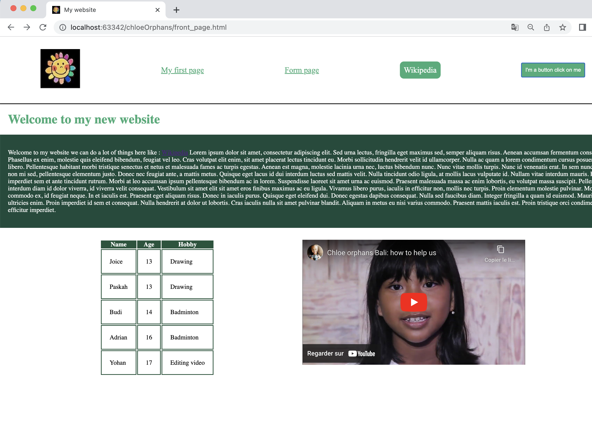
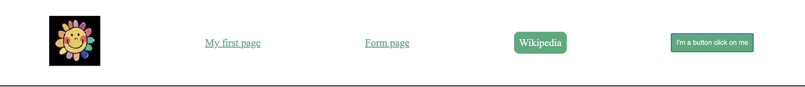
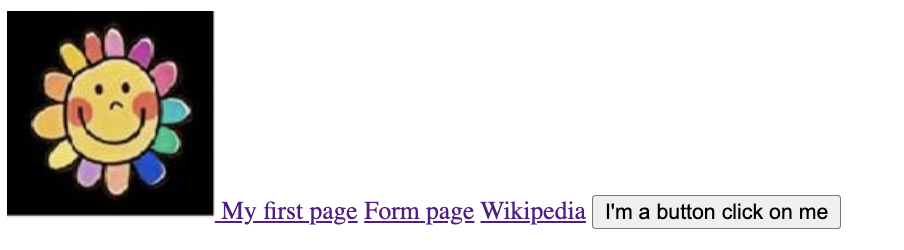

# Belajar membuat kode situs web pertama Anda

[](README.in.md)

## Tujuan

Kita akan membuat situs web pertama kita sebagai tambahan dari halaman pertama yang telah Anda buat

Anda harus membuat situs web yang akan terlihat seperti ini:



Anda dapat menggunakan teks, foto, desain, dan video apa pun yang Anda inginkan. Tampilannya harus seperti halaman ini.

## Pelajaran

Sekarang kita akan mengikuti langkah-langkah untuk membantu Anda membuat halaman ini.

Pertama, kita harus membuat file html baru (misalnya ``first_page.html``)

Setelah itu kita akan membuat bagian ini, yang disebut ``Header``, yaitu bagian kepala halaman:



Untuk melakukan hal ini, kita akan menggunakan ``<div>`` dan meletakkan hal-hal lain di dalamnya.
``<div>`` ini harus berisi gambar seperti logo halaman Anda, dan akan dialihkan ke halaman ini ketika diklik,
3 tautan yang mengarahkan ke halaman pertama yang telah Anda buat, beberapa minggu yang lalu, ke halaman baru yang belum ada untuk saat ini,
dan yang terakhir harus
dibuka di halaman web lain (seperti wikipedia misalnya) tetapi di jendela lain (gunakan target="_blank" untuk melakukannya).
Yang terakhir adalah tombol yang juga mengarahkan ke situs web yang Anda inginkan.

Seharusnya terlihat seperti ini.



Setelah membuat ini, kita perlu menambahkan desain pada header sehingga terlihat seperti ini.
Untuk melakukannya kita akan membuat berkas baru bernama ``style.css``.
Untuk menggunakannya, kita akan memanggil file tersebut di dalam file html kita. Tambahkan file :

```html

<link rel="stylesheet" type="text/css" href="style.css">
```

antara

````html

<head></head>
````

dari file html Anda.

Itu saja. Sekarang kita dapat menambahkan desain ke halaman kita menggunakan file ini.Untuk mencobanya, tambahkan ke ``<div>`` Anda
atribut `id` seperti ini:

```html

<div id="header">
```

sebagai contoh.

Sekarang, kita dapat menggunakan can di file css kita dan menambahkan file :

```css
#header {
    display: flex;
    justify-content: space-around;
    align-items: center;
}
```

Seperti yang Anda lihat, kita menggunakan ``flexbox`` untuk memodifikasi halaman kita.
Sekarang kita dapat menambahkan sedikit css untuk menambahkan sedikit perubahan.

```css
#header {
    display: flex;
    justify-content: space-around;
    align-items: center;
    margin-top: 2%;
    padding-bottom: 2%;
    font-size: 20px;
    border-bottom: solid black;
    font-family: "Times New Roman", Times, serif;
}
```

Cobalah setiap hal baru yang Anda pahami cara kerjanya. Jika Anda tidak memahami apa yang dimodifikasi, tanyakan kepada kami.

Setelah ini kita akan menambahkan warna dan gaya pada tombol dan tautan. Jadi kita
kita perlu menambahkan ``classes`` dan ``id`` pada tautan dan tombol kita, agar dapat dimodifikasi di dalam berkas css.

Sebuah ``id`` bersifat unik namun sebuah kelas yang sama dapat digunakan untuk hal yang berbeda. Dua tautan pertama dari halaman kita memiliki
gaya yang sama, jadi kita akan menggunakan kelas yang sama, seperti ini:

```html
<a href="first_page.html" class="link_to_page">My first page</a>
<a href="form_page.html" class="link_to_page">Form page</a>
```

Dan untuk tombol dan tautan terakhir, keduanya berbeda dan unik, sehingga Anda dapat menggunakan
sebuah ``id``.

Sekarang masuk ke dalam file css dan tambahkan file :
```css
.link_to_page {
    color: #3EAC78;
}

.link_to_page:hover {
    color: #1f543b;
}
```

Hal ini akan menambah warna pada tautan Anda. #3EAC78 adalah warna hijau tertentu,
Anda dapat memilih warna yang Anda inginkan. Jika Anda menginginkan warna tertentu, buka situs web ini:
https://htmlcolorcodes.com/. Pilih warna yang Anda inginkan dan salin nomor setelah tanda # yang akan terlihat seperti ini : ```FF5733```

Tanda ```:hover``` menambahkan kepatutan bahwa ketika Anda mengarahkan mouse ke tautan
tersebut akan berubah warna. Kita akan menggunakannya juga untuk link yang lain.

Sekarang, mari kita memodifikasi tombol dan tautan lainnya. Saya telah memberikan link terakhir saya (link wikipedia) dengan id ``wiki``.
Jika kita menambahkan css ini:

```css
#header button, #wiki {
    color: white;
    background-color: #3EAC78;
    padding: 10px;
    border: none;
    text-decoration: none;
}

#header button:hover, #wiki:hover {
    color: white;
    background-color: #1f543b;
}
```

Anda akan melakukan transformasi header. Cobalah untuk memahami cara kerjanya. Jika
Anda memiliki pertanyaan, tanyakan kepada kami.

Terakhir, untuk header, kita akan memodifikasi ukuran gambar kita dan kita akan menambahkan sudut bulat pada tautan terakhir.
Untuk melakukannya, tambahkan ini ke css Anda:

```css
#header img {
    width: 100px;
}

#wiki {
    border-radius: 10px;
}
```

Setelah ini kami memiliki judul besar. Judul ini adalah judul ``h1``.
Di dalam file css, Anda dapat menambahkan warna pada judul jika Anda mau, dan
menambahkan banyak hal untuk menatanya seperti yang Anda inginkan.

Dan tepat setelah ini, adalah sebuah ``div`` baru dan paragraf di dalamnya, dengan sebuah tautan.
Pada banner ini, kita dapat menambahkan ``background`` atau ``background-image`` jika Anda menginginkannya (menggunakan gambar ini
misalnya ``data: image/png; base64,
Anda dapat meletakkan teks apa pun yang Anda inginkan di dalamnya. Teks tersebut juga dapat diberi ``color: white;`` untuk membuat teks menjadi putih.

Sekarang bagian selanjutnya, Anda harus memahami cara membuatnya. Hal pertama adalah sebuah tabel seperti ini:

```html

<table>
    <tr>
        <th>title1</th>
        <th>title2</th>
        <th>title3</th>
    </tr>
    <tr>
        <td>What you want</td>
        <td>What you want</td>
        <td>What you want</td>
    </tr>
    <tr>
        <td>What you want</td>
        <td>What you want</td>
        <td>What you want</td>
    </tr>
</table>
```

Anda harus menambahkan sendiri desain yang Anda inginkan. Yang kedua
yang kedua adalah menambahkan video Youtube. Jika terlalu rumit, tanyakan kepada kami.

Setelah Anda melakukan semua hal ini, Anda sekarang dapat memodifikasi halaman pertama yang telah Anda buat.