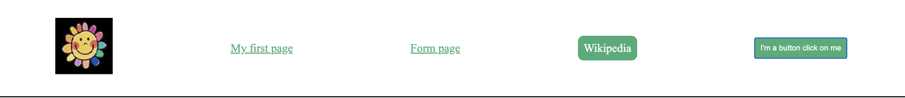

# Learning to code your first website

[](README.in.md)

## Objectives

We are going to create our first website in addition of the first page you have created.

You have to create a website that will look like this :


You can use what ever text, photos, designs and video you want. It just has to look like this page.

## The lesson

Now we are going to follow steps to help you create this page.

First we have to create a new html file (for example ``first_page.html``)

After this we are going to create this part, which is called the ``Header``, the head of the page :



To do this we are going to use ``<div>`` and put the other things in it.
This ``<div>`` must contain an image like the logo of your page, and that redirects to this page when it is clicked,
3 links that redirects to The first page you have created, a few weeks ago, to a new page that does not exist for now,
and the last one must
open on another web page (like wikipedia for example) but in another window (use target="_blank" to do so).
The last one is a button that also redirect to a website that you want to.

It should look like something like this.


After having created this we need to add design to our header so that it looks like this.
To do so we are going to create a new file called ``style.css``.
To use it we are going to call the file in our html file. Add this :

```html

<link rel="stylesheet" type="text/css" href="style.css">
```

between the

````html

<head></head>
````

of your html file.

That's it. Now we can add design to our page using this file. To try this add to your ``<div>``
the attribute `id` like this :

```html

<div id="header">
```

for example.

Now, we can use can go in our css file and add this :

```css
#header {
    display: flex;
    justify-content: space-around;
    align-items: center;
}
```

As you can see, we are using ``flexbox`` to modify our page.
Now we can add a bit more css to add little changes.

```css
#header {
    display: flex;
    justify-content: space-around;
    align-items: center;
    margin-top: 2%;
    padding-bottom: 2%;
    font-size: 20px;
    border-bottom: solid black;
    font-family: "Times New Roman", Times, serif;
}
```

Try each new thing that you understand how it works. If you don't understand what it modifies, ask us.

After this we are going to add colors and style to our buttons and links. So we
need to add ``classes`` and ``id`` to our links and button, that they can be modified in the css file.

An ``id`` is unique but a same class can be used for different things. The first 2 links are of our page have
the same style, so we are going to use our the same class, like this :

```html
<a href="first_page.html" class="link_to_page">My first page</a>
<a href="form_page.html" class="link_to_page">Form page</a>
```

And for the button and the last link, they are different and unique, so you can use
an ``id``.

Now go in the css file and add :
```css
.link_to_page {
    color: #3EAC78;
}

.link_to_page:hover {
    color: #1f543b;
}
```

This adds color to your links. #3EAC78 is a specific green colour,
you can choose the colour you want. If you want a specific colour, go on this website :
https://htmlcolorcodes.com/. Choose the colour that you want and copy the number  after the # sign that should look like this : ``FF5733```

The ```:hover``` adds a propriety that when you pass your mouse on the 
link, it changes colour. We will use it also for the other links.

Now, let's modify the rest of the button and link. I have gave my last link (the wikipedia one) the id ``wiki``.
If we add this css :

```css
#header button, #wiki {
    color: white;
    background-color: #3EAC78;
    padding: 10px;
    border: none;
    text-decoration: none;
}

#header button:hover, #wiki:hover {
    color: white;
    background-color: #1f543b;
}
```

You will the transformation of the header. Try to understand how it works. If 
you have any question, ask us.

Lastly, for the header, we are going to modify the size of our image and we will add round corners to the last link.
To do so, add this to your css : 

```css
#header img {
    width: 100px;
}

#wiki {
    border-radius: 10px;
}
```

After this we have a big title. This title is a ``h1`` title.
In the css file, you can add a color to the title if you want, and 
add many things to want to style it like you want.

And just after this, is a new ``div`` and a paragraph in it, with also a link.
To this banner, we can add a ``background`` or a ``background-image``if you want (using this image 
for example ``data:image/png;base64,iVBORw0KGgoAAAANSUhEUgAAAOEAAADhCAMAAAAJbSJIAAAAA1BMVEUbSzsVjw6hAAAASElEQVR4nO3BgQAAAADDoPlTX+AIVQEAAAAAAAAAAAAAAAAAAAAAAAAAAAAAAAAAAAAAAAAAAAAAAAAAAAAAAAAAAAAAAADwDcaiAAFXD1ujAAAAAElFTkSuQmCC``).
You can put any text you want in it. The text as also ``color: white;`` to make the text white.

Now the next section, you should understand how to create it. The first thing is a table like this :

```html

<table>
    <tr>
        <th>title1</th>
        <th>title2</th>
        <th>title3</th>
    </tr>
    <tr>
        <td>What you want</td>
        <td>What you want</td>
        <td>What you want</td>
    </tr>
    <tr>
        <td>What you want</td>
        <td>What you want</td>
        <td>What you want</td>
    </tr>
</table>
```

You will have to add the design that you want by yourself. The second 
thing add is a Youtube video. If it is to much complicated, ask us.

Once you have done all these things you can now modify the first page you have created.